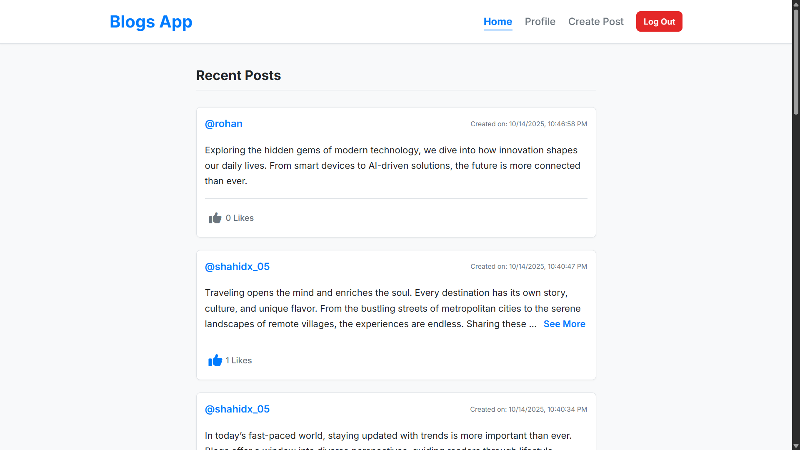
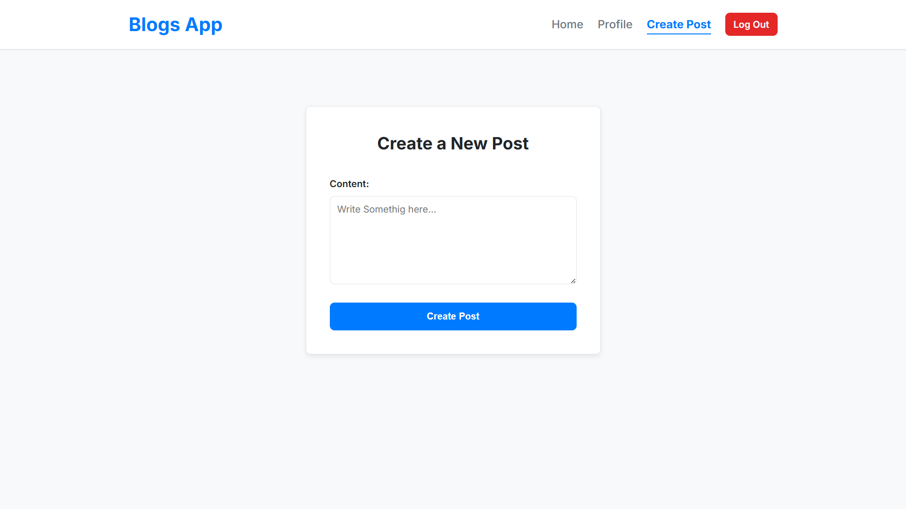

# 📝 Full-Stack Blog Application (MPA & REST API)

<div align="center">

**A complete, full-stack blog application built from scratch with a secure Node.js REST API and a dynamic Multi-Page Application (MPA) frontend using Vanilla JavaScript.**

</div>



---

## ✨ About This Project

This project demonstrates the creation of a modern web application with a clear separation between a secure backend API and a user-facing frontend. It features full user authentication, complete CRUD functionality for posts, and interactive features like a "like" system.

The frontend is built as a classic Multi-Page Application, where each page (`index.html`, `profile.html`, etc.) handles its own logic, providing a robust and easy-to-understand codebase.

---

## 🚀 Key Features

### Backend (REST API)
-   ✅ **Secure Authentication**: Full user registration and login system using **JWT (JSON Web Tokens)**.
-   ✅ **Password Hashing**: Passwords are securely hashed with `bcrypt` before being stored.
-   ✅ **Protected Routes**: Custom middleware ensures that only authenticated users can create, edit, delete, or like posts.
-   ✅ **Full CRUD for Posts**: Complete API endpoints to Create, Read, Update, and Delete blog posts.
-   ✅ **Authorization**: Logic prevents users from editing or deleting posts they did not create.
-   ✅ **Like/Unlike System**: A dedicated endpoint to toggle a "like" on any post.
-   ✅ **Data Relationships**: Cleanly modeled one-to-many relationship between Users and Posts using Mongoose.

### Frontend (Multi-Page Application)
-   ✅ **User Dashboard**: A dedicated profile page showing user details, post count, and a list of their own posts.
-   ✅ **Full Post Management**: Users can create, edit, and delete their own posts from the UI.
-   ✅ **Interactive "Like" Button**: Like or unlike any post with instant UI feedback (color change and count update) without a page refresh.
-   ✅ **"See More" for Long Posts**: Long posts on the homepage are automatically truncated with a "See More" button for a cleaner layout.
-   ✅ **Dynamic Navigation**: The navigation bar intelligently shows the correct links based on whether the user is logged in or out.
-   ✅ **Auth Guarding**: Protected pages (like Profile) automatically redirect to the login page if the user is not authenticated.
-   ✅ **Responsive Design**: The UI is fully responsive and looks great on both desktop and mobile devices.

---

## 🛠️ Tech Stack

### Backend


### Frontend


---

## 📸 Project Preview

| Profile Page / Dashboard | All Posts (Home) |
| :---: | :---: |
|  |  |
| **Login Page** | **Edit Post Page** |
|  |  |


---

## 📂 Installation & Setup

This project uses a monorepo structure with separate `backend` and `frontend` folders.

### **Backend Setup**

1.  **Clone the Repository**
    ```bash
    git clone https://github.com/shahidx05/blogs-app
    
    cd your-repo-name
    ```
2.  **Navigate to the Backend Directory**
    ```bash
    cd backend
    ```
3.  **Install Dependencies**
    ```bash
    npm install
    ```
4.  **Set Up Environment Variables**
    Create a `.env` file in the `/backend` folder and add the following:
    ```env
    MONGO_URI=your_mongodb_connection_string
    PORT=3000
    JWT_SECRET=a_very_long_and_secret_key
    ```
5.  **Run the Server**
    ```bash
    npm start
    ```
    The API will now be running on `http://localhost:3000`.

---
### **Frontend Setup**

1.  **Navigate to the Frontend Directory**
    ```bash
    cd ../frontend
    ```
2.  **Run with a Live Server**
    * If you are using VS Code, install the **[Live Server](https://marketplace.visualstudio.com/items?itemName=ritwickdey.LiveServer)** extension.
    * Right-click on the `index.html` file and select "Open with Live Server".
    * Your application will open in your browser (e.g., at `http://127.0.0.1:5500`).

---

## 👨‍💻 Author

**Shahid Khan**

🚀 Learning in public | #WebDev #BuildInPublic

🔗 [LinkedIn](https://www.linkedin.com/in/shahidx05) • [X (Twitter)](https://twitter.com/shahidx_05)