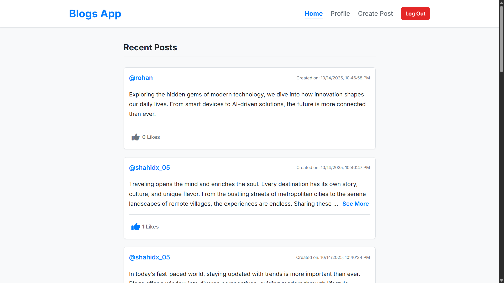
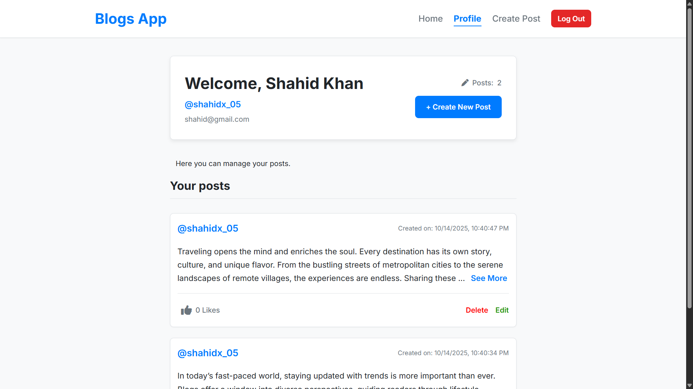
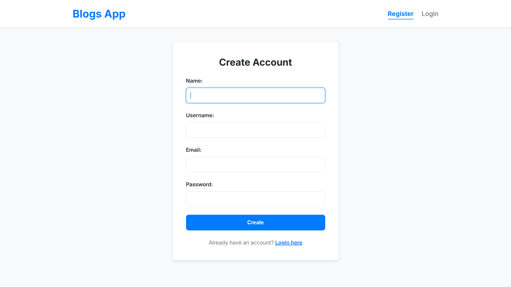

# 📝 Full-Stack Blog Application (MPA & SPA)

<div align="center">

**A complete, full-stack blog application featuring a secure Node.js REST API and two distinct frontends: a classic Multi-Page Application (MPA) and a modern, deployed Single Page Application (SPA).**

</div>

---

## 🚀 Live Demo & API

**Click the image below to experience the live Single Page Application:**

<a href="https://blogs-app-shahidx05.vercel.app/" target="_blank">
  
</a>

**Frontend SPA Live Link:**
### [https://blogs-app-shahidx05.vercel.app/](https://blogs-app-shahidx05.vercel.app/)

**Backend API Base URL (Deployed on Render):**
### [https://blogs-app-backend-w58h.onrender.com/api](https://blogs-app-backend-w58h.onrender.com/api)

---

## ✨ About This Project

This repository showcases the evolution of a full-stack project. It starts with a secure Node.js backend and includes two distinct frontends:

1.  **Multi-Page Application (MPA):** The original frontend, built with separate HTML files for each page. This version demonstrates a classic and robust approach to web development.
2.  **Single Page Application (SPA):** The modern, deployed version. It provides a seamless and fluid user experience without page reloads, powered by a custom-built vanilla JavaScript router.

---

## 🎯 Key Features

### Backend (REST API)
-   ✅ **Secure Authentication**: Full user registration and login system using **JWT (JSON Web Tokens)**.
-   ✅ **Password Hashing**: Passwords are securely hashed with `bcrypt`.
-   ✅ **Protected Routes**: Custom middleware ensures only authenticated users can perform sensitive actions.
-   ✅ **Full CRUD for Posts**: Complete API endpoints to Create, Read, Update, and Delete blog posts.
-   ✅ **Like/Unlike System**: A dedicated endpoint to toggle a "like" on any post.

### Frontend (Single Page Application)
-   ✅ **Seamless SPA Navigation**: A custom hash-based router provides instant page transitions without full-page reloads.
-   ✅ **User Dashboard**: A dedicated profile page showing user details and a list of their own posts.
-   ✅ **Full Post Management**: Users can create, edit, and delete their own posts from the UI.
-   ✅ **Interactive Actions**: Like or unlike any post with instant UI feedback without leaving the page.
-   ✅ **Dynamic Navigation**: The navigation bar intelligently shows the correct links and active state based on login status.
-   ✅ **Auth Guarding**: Protected pages automatically redirect to the login page if the user is not authenticated.
-   ✅ **Responsive Design**: The UI is fully responsive and looks great on all devices.

---

## 🛠️ Tech Stack

### Backend


### Frontend


---

## 🧠 Concepts Practiced

-   RESTful API Design
-   JWT Authentication & Authorization
-   Password Hashing (bcrypt)
-   Environment Variables (.env)
-   Database Modeling (Mongoose Schemas)
-   Frontend Routing (Vanilla JS Hash-based Router)
-   SPA vs MPA Architecture
-   Asynchronous JavaScript (async/await, Fetch API)
-   DOM Manipulation
-   Event Handling & Delegation
-   Local Storage for Token Management
-   Responsive Web Design
-   CORS Configuration
-   Deployment (Backend on Render, Frontend on Vercel)

---

## 📸 Project Preview

**Note:** Update image paths if necessary for correct display on GitHub.

| Profile Page / Dashboard | All Posts (Home) |
| :---: | :---: |
|  |  |
| **Login Page** | **Create/Edit Post Page** |
|  |  |

---

## 📁 Repository Structure
```
blogs-app/ 
├── backend/ # REST API built with Node.js and Express 
├── frontend-MPA/ # Classic Multi-Page Application (Original Version) 
└── frontend-SPA/ # Modern Single Page Application (Deployed Version)
```

---

## 📂 Installation & Setup

### **Backend Setup**

1.  **Clone the Repository**
    ```bash
    git clone https://github.com/shahidx05/blogs-app
    ```
2.  **Navigate to the Backend Directory**
    ```bash
    cd backend
    ```
3.  **Install Dependencies**
    ```bash
    npm install
    ```
4.  **Set Up Environment Variables**
    Create a `.env` file in the `/backend` folder:
    ```env
    MONGO_URI=your_mongodb_connection_string
    PORT=3000
    JWT_SECRET=a_very_long_and_secret_key
    ```
5.  **Run the Server**
    ```bash
    npm start
    ```
    The API will run on `http://localhost:3000`.

---
### **Frontend Setup**

#### **1. Frontend (Single Page Application - Deployed Version)**

1.  **Navigate to the SPA Directory**
    ```bash
    # From the root 'blogs-app' folder
    cd frontend-SPA
    ```
2.  **Run with a Live Server**
    -   The `js/api.js` file automatically detects the environment.
    -   In VS Code, right-click `index.html` and select "Open with Live Server".

#### **2. Frontend (Multi-Page Application - Original Version)**

1.  **Navigate to the MPA Directory**
    ```bash
    # From the root 'blogs-app' folder
    cd frontend-MPA
    ```
2.  **Run with a Live Server**
    -   In VS Code, right-click `index.html` and select "Open with Live Server".

---

## 📄 License

[](https://opensource.org/licenses/MIT)

This project is licensed under the MIT License — feel free to use and modify it for learning purposes.

---

## 👨‍💻 Author

**Shahid Khan**

Connect with me:

[](https://www.linkedin.com/in/shahidx05)
[](https://x.com/shahidx_05)
